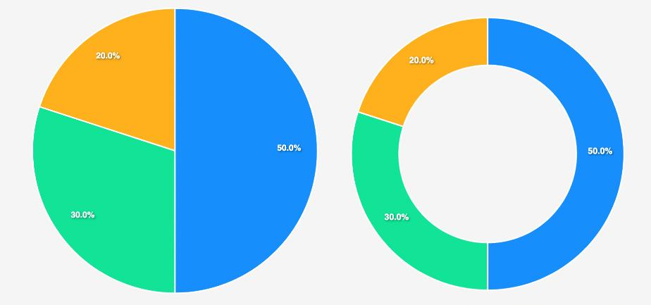

# MODUL 7: Visualisasi Data Database dalam Bentuk Grafik Menggunakan Chart.js dan Bootstrap

## 7.1 Tujuan Praktikum
Setelah mengikuti praktikum ini, praktikan diharapkan dapat:
1. Memahami konsep visualisasi data dan pentingnya grafik dalam penyajian informasi.
2. Mengenal jenis-jenis grafik dan kapan menggunakannya.
3. Mengintegrasikan **Chart.js** untuk membuat grafik interaktif pada halaman web.
4. Menggunakan **Bootstrap** untuk mempercantik layout halaman web.
5. Menampilkan data dari **database MySQL** ke dalam bentuk grafik menggunakan **PHP**.

## 7.2 Alat & Bahan
1. Laptop
2. Software Visual Studio Code
3. Software XAMPP / Laragon (Apache + MySQL sudah berjalan)
4. Browser modern (Chrome / Firefox / Edge)
5. Database `toko_online_XXXX` yang sudah dibuat pada **Modul 6**

> ⚠️ **Penting:** Pastikan database `toko_online_XXXX` dari Tugas Pendahuluan Modul 6 **masih ada** di phpMyAdmin. Data di dalamnya akan digunakan pada praktikum ini.

---

## 7.3 Dasar Teori

### 7.3.1 Apa itu Visualisasi Data?



**Visualisasi data** adalah cara menyajikan data dalam bentuk visual (grafik, diagram, chart) agar informasi lebih mudah dipahami dibandingkan membaca angka-angka mentah dalam tabel.

**Analogi sederhana:**
Bayangkan kamu punya data penjualan 12 bulan dalam sebuah tabel. Membaca 12 baris angka tentu membutuhkan waktu untuk memahami tren. Tapi kalau data yang sama ditampilkan dalam bentuk **grafik garis**, kamu bisa langsung melihat bulan mana yang penjualannya naik atau turun - hanya dalam hitungan detik.

**Mengapa visualisasi data penting?**
- 📊 Mempermudah pemahaman data yang kompleks
- 📈 Memperlihatkan tren, pola, dan perbandingan secara cepat
- 🎯 Membantu pengambilan keputusan berbasis data
- 🌐 Membuat laporan dan dashboard web menjadi lebih informatif

---

### 7.3.2 Jenis-Jenis Grafik

Berikut adalah jenis grafik yang paling umum digunakan dalam pengembangan web:

| No | Jenis Grafik | Kegunaan | Contoh Penggunaan |
|----|-------------|----------|-------------------|
| 1 | **Pie Chart** (Lingkaran) | Menampilkan proporsi/persentase dari keseluruhan | Persentase penjualan per kategori produk |
| 2 | **Bar Chart** (Batang Horizontal) | Membandingkan data antar kategori | Perbandingan stok produk per jenis |
| 3 | **Column Chart** (Batang Vertikal) | Membandingkan data dengan sumbu vertikal | Penjualan per bulan |
| 4 | **Line Chart** (Garis) | Melihat tren data berdasarkan waktu | Tren pengunjung website per hari |
| 5 | **Doughnut Chart** (Donat) | Variasi pie chart dengan lubang di tengah | Distribusi anggaran per departemen |
| 6 | **Area Chart** (Area) | Seperti line chart, tapi area di bawah garis diwarnai | Pertumbuhan revenue dari waktu ke waktu |

> 💡 **Tips memilih grafik:**
> - Ingin menunjukkan **proporsi**? → Pie / Doughnut
> - Ingin **membandingkan** antar kategori? → Bar / Column
> - Ingin melihat **tren waktu**? → Line / Area

---

### 7.3.3 Apa itu Chart.js?

**Chart.js** adalah library JavaScript **open-source** yang digunakan untuk membuat grafik interaktif dan responsif pada halaman web. Chart.js merender grafik menggunakan elemen HTML5 `<canvas>`.

**Kenapa menggunakan Chart.js?**
| Fitur | Keterangan |
|-------|-----------|
| 🆓 Gratis & Open Source | Bisa digunakan untuk proyek apa saja |
| 📱 Responsif | Otomatis menyesuaikan ukuran layar |
| 🎨 Mudah Dikustomisasi | Warna, font, animasi bisa diatur |
| ⚡ Ringan | Ukuran file kecil (~60KB gzipped) |
| 📊 8 Jenis Grafik | Bar, Line, Pie, Doughnut, Radar, dll |
| 🖱️ Interaktif | Tooltip muncul saat hover di grafik |
| 🔌 Mudah Diintegrasikan | Cukup include via CDN, tidak perlu install |

**Cara menggunakan Chart.js:**
Cukup tambahkan satu baris di HTML untuk memuat library dari CDN (Content Delivery Network):

```html
<script src="https://cdn.jsdelivr.net/npm/chart.js"></script>
```

Kemudian buat elemen `<canvas>` sebagai tempat grafik di-render:

```html
<canvas id="myChart"></canvas>
```

Dan buat grafik menggunakan JavaScript:

```javascript
new Chart(document.getElementById('myChart'), {
    type: 'pie',           // Jenis grafik
    data: {
        labels: ['A', 'B', 'C'],   // Label data
        datasets: [{
            data: [30, 50, 20],     // Nilai data
            backgroundColor: ['#f94144', '#90be6d', '#577590']  // Warna
        }]
    }
});
```

> 📌 **Catatan:** Pada `index.php` di modul ini, kita akan menggantikan data statis (`[30, 50, 20]`) dengan **data dinamis dari database MySQL** menggunakan PHP.

---

### 7.3.4 Apa itu Bootstrap?


**Bootstrap** adalah **framework CSS** open-source yang menyediakan komponen siap pakai (tombol, card, grid, navbar, dll) untuk mempercantik tampilan website tanpa harus menulis CSS dari nol.

**Kenapa menggunakan Bootstrap?**
- ✅ **Responsif otomatis** - layout menyesuaikan ukuran layar (desktop, tablet, HP)
- ✅ **Cepat & efisien** - tinggal pakai class, tidak perlu buat CSS sendiri
- ✅ **Konsisten** - tampilan seragam di semua halaman
- ✅ **Dokumentasi lengkap** - [getbootstrap.com](https://getbootstrap.com/docs/)

**Cara menggunakan Bootstrap:**
Tambahkan link CSS Bootstrap di dalam `<head>`:

```html
<link href="https://cdn.jsdelivr.net/npm/bootstrap@5.3.0/dist/css/bootstrap.min.css" rel="stylesheet">
```

Setelah itu, kamu bisa langsung menggunakan class-class Bootstrap di HTML:

```html
<!-- Container dengan padding -->
<div class="container py-5">
    <!-- Card dengan shadow -->
    <div class="card shadow-sm">
        <div class="card-body">
            <h5 class="card-title">Judul Card</h5>
            <p>Isi konten di sini...</p>
        </div>
    </div>
</div>
```

**Class Bootstrap yang akan sering dipakai di modul ini:**

| Class | Fungsi |
|-------|--------|
| `container` | Membuat wrapper dengan lebar maksimal yang responsif |
| `row` & `col-*` | Sistem grid untuk mengatur layout kolom |
| `card`, `card-body` | Membuat kotak konten dengan border dan shadow |
| `shadow-sm` | Menambahkan bayangan halus pada elemen |
| `text-center` | Meratakan teks ke tengah |
| `mb-*`, `py-*`, `mt-*` | Margin dan padding (spacing) |
| `bg-light` | Background warna abu-abu terang |

---

### 7.3.5 Mengambil Data Database untuk Grafik (PHP + MySQL)

Pada modul sebelumnya (Modul 5 & 6), kita sudah belajar cara:
- Menghubungkan PHP ke MySQL menggunakan `mysqli_connect()`
- Menjalankan query SQL (`SELECT`, `INSERT`, `UPDATE`, `DELETE`)
- Menampilkan data dalam tabel HTML

Pada modul ini, kita akan mengambil data dari database yang **sama** (yang sudah dibuat di Modul 6), lalu meneruskan data tersebut ke **Chart.js** agar ditampilkan sebagai grafik.

**Alur kerjanya:**

```
Database MySQL (toko_online_XXXX)
        ↓  query SQL (SELECT)
PHP mengambil data
        ↓  json_encode()
JavaScript (Chart.js) menerima data
        ↓  render
Grafik ditampilkan di browser
```

**Kode penting - Cara passing data dari PHP ke JavaScript:**

```php
<?php
// 1. Koneksi ke database (sama seperti Modul 6)
$koneksi = mysqli_connect("localhost", "root", "", "toko_online_XXXX");

// 2. Query untuk mengambil data
$sql    = "SELECT nama_produk, harga FROM produk";
$result = mysqli_query($koneksi, $sql);
$all    = mysqli_fetch_all($result);

// 3. Pisahkan data menjadi label dan nilai
$labels = array_column($all, 0);  // kolom pertama → nama produk
$data   = array_column($all, 1);  // kolom kedua → harga
?>

<!-- 4. Kirim data PHP ke JavaScript menggunakan json_encode() -->
<script>
    const labels = <?= json_encode($labels) ?>;
    const values = <?= json_encode($data) ?>;
    
    // Sekarang labels dan values bisa dipakai di Chart.js
</script>
```

> 💡 **`json_encode()`** mengubah array PHP menjadi format JSON yang bisa dibaca oleh JavaScript. Ini adalah "jembatan" antara PHP (server-side) dan JavaScript (client-side).

**Penjelasan fungsi PHP yang dipakai:**

| Fungsi PHP | Penjelasan |
|-----------|-----------|
| `mysqli_connect()` | Membuat koneksi ke database MySQL |
| `mysqli_query()` | Menjalankan query SQL dan mengembalikan hasil |
| `mysqli_fetch_all()` | Mengambil semua baris hasil query sebagai array |
| `array_column()` | Mengekstrak satu kolom dari array multidimensi |
| `json_encode()` | Mengubah data PHP menjadi format JSON |

---

## 7.4 Langkah Praktikum

### Persiapan
1. Pastikan **XAMPP / Laragon** sudah berjalan (Apache + MySQL).
2. Pastikan database `toko_online_XXXX` dari Modul 6 masih ada.
3. Buat folder **`modul7`** di dalam `C:\xampp\htdocs\` (atau folder Laragon yang setara).
4. Buat file **`index.php`** di dalam folder `modul7`.

### Struktur File
```
C:\xampp\htdocs\modul7\
    └── index.php
```

### Kode `index.php`

> ⚠️ **Ganti `toko_online_XXXX`** dengan nama database kalian yang sebenarnya (sesuai 4 NIM terakhir dari Modul 6).

```php
<?php
// ============================================================
// BAGIAN 1: KONEKSI DATABASE & PENGAMBILAN DATA (PHP)
// ============================================================

// Koneksi ke database (sama seperti cara di Modul 6)
$koneksi = mysqli_connect("localhost", "root", "", "toko_online_XXXX");

// Cek apakah koneksi berhasil
if (!$koneksi) {
    die("Koneksi gagal: " . mysqli_connect_error());
}

// Query: Ambil nama produk dan harga dari tabel produk
$sql    = "SELECT nama_produk, harga FROM produk";
$result = mysqli_query($koneksi, $sql);
$all    = mysqli_fetch_all($result);

// Pisahkan data menjadi array label (nama) dan array nilai (harga)
$labels = array_column($all, 0);  // Kolom 0 = nama_produk
$data   = array_column($all, 1);  // Kolom 1 = harga

// Palet warna untuk grafik
$colors = [
    '#f94144', '#f3722c', '#f9844a', '#f9c74f',
    '#90be6d', '#43aa8b', '#577590', '#277da1'
];
?>
<!DOCTYPE html>
<html lang="id">
<head>
    <meta charset="UTF-8">
    <meta name="viewport" content="width=device-width, initial-scale=1.0">
    <title>Grafik Data Produk - Modul 7</title>

    <!-- Bootstrap 5 CSS (framework CSS untuk layout responsif) -->
    <link href="https://cdn.jsdelivr.net/npm/bootstrap@5.3.0/dist/css/bootstrap.min.css" rel="stylesheet">

    <!-- Chart.js (library untuk membuat grafik) -->
    <script src="https://cdn.jsdelivr.net/npm/chart.js"></script>
</head>
<body class="bg-light">

<!-- ============================================================ -->
<!-- BAGIAN 2: TAMPILAN HTML + BOOTSTRAP                          -->
<!-- ============================================================ -->

<div class="container py-5">
    <h2 class="text-center mb-5">📊 Visualisasi Data Produk</h2>

    <div class="row justify-content-center">
        <div class="col-lg-6 col-md-8">
            <div class="card shadow-sm">
                <div class="card-body">
                    <h5 class="card-title text-center mb-4">Pie Chart - Harga Produk</h5>
                    <canvas id="chartPie"></canvas>
                </div>
            </div>
        </div>
    </div>
</div>

<!-- ============================================================ -->
<!-- BAGIAN 3: JAVASCRIPT + CHART.JS (membuat grafik)             -->
<!-- ============================================================ -->

<script>
    // Data dari PHP dikirim ke JavaScript via json_encode()
    const labels   = <?= json_encode($labels) ?>;
    const values   = <?= json_encode($data) ?>;
    const bgColors = <?= json_encode($colors) ?>;

    // Membuat Pie Chart
    new Chart(document.getElementById('chartPie'), {
        type: 'pie',
        data: {
            labels: labels,
            datasets: [{
                label: 'Harga (Rp)',
                data: values,
                backgroundColor: bgColors,
                borderColor: '#fff',
                borderWidth: 2
            }]
        },
        options: {
            responsive: true,
            plugins: {
                legend: { position: 'bottom' }
            }
        }
    });
</script>

</body>
</html>
```

### Lihat Hasilnya
Buka browser dan akses: [http://localhost/modul7/index.php](http://localhost/modul7/index.php)

---

## 7.5 Penjelasan Kode Secara Detail

### Bagian 1 - PHP (Server-Side)
Kode PHP berjalan di **server** (XAMPP). Tugasnya:
1. **Koneksi** ke database MySQL menggunakan `mysqli_connect()` - ini sama persis seperti yang dipelajari di Modul 6.
2. **Query** data produk menggunakan `SELECT`.
3. **Memproses** hasil query menjadi dua array: `$labels` (nama produk) dan `$data` (harga).
4. **Mengirim** data ke JavaScript menggunakan `json_encode()`.

### Bagian 2 - HTML + Bootstrap (Struktur & Layout)
- `container` → wrapper responsif
- `row` + `col-lg-6` → mengatur lebar konten (6 dari 12 kolom di layar besar)
- `card` + `shadow-sm` → kotak konten dengan bayangan
- `<canvas id="chartPie">` → tempat Chart.js me-render grafik

### Bagian 3 - JavaScript + Chart.js (Client-Side)
- `<?= json_encode($labels) ?>` → PHP mencetak array sebagai JSON ke JavaScript
- `new Chart(...)` → membuat instance grafik baru
- `type: 'pie'` → jenis grafik Pie
- `data.labels` → label yang ditampilkan di legend
- `data.datasets[0].data` → nilai numerik untuk grafik
- `backgroundColor` → warna setiap bagian pie

---

## Credits
- Pengembang modul: [Nabil Fikry Khaidar](https://github.com/Nabilfikry)

